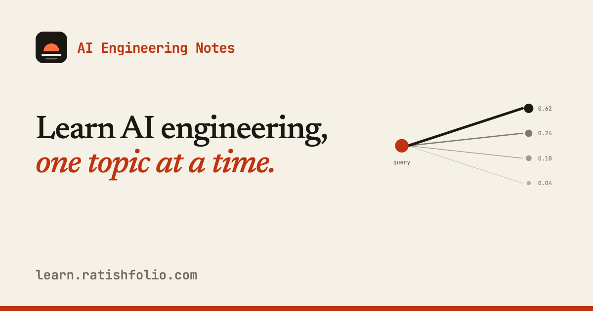

# AI Engineering Notes

**Learning AI engineering in public, one topic at a time.**

I write up one AI engineering topic at a time: what I understood and the resources I used. No fixed syllabus. The next topic is whatever is worth understanding next.

**Live site: https://learn.ratishfolio.com**



## Topics

| # | Topic | Notes |
| - | ----- | ----- |
| 01 | [Attention](https://learn.ratishfolio.com/llms/attention/) | Q, K, V, softmax, self vs cross attention, causal and multi-head attention, engineering trade-offs |
| 02 | [KV Cache](https://learn.ratishfolio.com/llms/kv-cache/) | Reusing Keys and Values to speed up inference, the GPU memory it costs, PagedAttention, GQA and MQA |

## Stack

- [Astro](https://astro.build) 7 + [Starlight](https://starlight.astro.build) for the docs
- [Tailwind CSS](https://tailwindcss.com) v4 with semantic theme tokens (light and dark)
- [Cloudflare Workers](https://developers.cloudflare.com/workers/) with static assets, served on a custom domain
- [Cloudflare D1](https://developers.cloudflare.com/d1/) for likes, feedback, subscribers and visit tracking
- [Resend](https://resend.com) for new-post emails
- Self-hosted fonts via Fontsource: Newsreader, IBM Plex Sans, JetBrains Mono

## Features

- Landing page and docs with a warm paper-and-ink theme, light and dark
- Resizable sidebar and content width, collapsible sidebar and table of contents (remembered per reader)
- Built-in search (Pagefind)
- SEO: canonical URLs, sitemap, `robots.txt`, `WebSite` and `TechArticle` structured data
- Social sharing: a generated Open Graph / Twitter card image for every topic (`/og/<topic>.png`)
- Engagement: likes (one per IP, hashed), feedback form and email signup, backed by D1 and rate limited
- New-post emails: subscribers get an email when a new topic is published, with one-click unsubscribe
- Email source tracking: links carry `utm_*` params and landings are recorded in the `visits` table

## Getting started

Requires Node 22.12+ and [pnpm](https://pnpm.io).

```bash
pnpm install
pnpm dev          # http://localhost:4321
pnpm build        # output in ./dist
pnpm preview      # preview the production build
```

## Project structure

```
src/
  assets/                logo files
  components/            landing page, footer, engagement and subscribe widgets
  content/docs/
    index.mdx            landing page entry
    llms/                topic pages and their images
  lib/                   API helpers, social card renderer (Satori + resvg)
  pages/api/             like, feedback, subscribe, unsubscribe, track
  pages/og/              per-topic card endpoint
  routeData.ts           per-page OG image and structured data
  styles/global.css      theme, typography, layout tweaks
migrations/              D1 schema
scripts/
  notify.mjs             emails subscribers about a new post
  email.mjs              email template
.github/workflows/       notify-subscribers: runs on pushes that add a post
public/
  pane-resize.js         sidebar and content resize / collapse
  track.js               records visits that carry utm_source
  email/                 logo and avatar used in emails
  og-default.png         social share image
  robots.txt
astro.config.mjs         Starlight, sidebar, head tags
wrangler.jsonc           Cloudflare Worker and custom domain
```

## Adding a topic

1. Create `src/content/docs/<section>/<topic>.md` with `title`, `description` and `date` (`YYYY-MM-DD`) frontmatter. The social card is generated from these.
2. Put images next to it in `<topic>-assets/` and give every image real alt text. Start the alt text of formula images with `Formula` so they get the white card styling.
3. Add the page to the `sidebar` in `astro.config.mjs`.
4. Push to `main`. A newly added topic is emailed to subscribers automatically (once per slug, tracked in `sent_posts`); edits to existing topics send nothing. Preview without sending: `DRY_RUN=1 node scripts/notify.mjs src/content/docs/<section>/<topic>.md`.

The email workflow needs the repo secrets `RESEND_API_KEY`, `CLOUDFLARE_API_TOKEN` (D1 edit) and `CLOUDFLARE_ACCOUNT_ID`. Apply schema changes with `pnpm exec wrangler d1 migrations apply learn-ai-engagement --remote`.

## Deploying

Deployed with [Wrangler](https://developers.cloudflare.com/workers/wrangler/):

```bash
pnpm build
pnpm exec wrangler login   # first time only
pnpm exec wrangler deploy
```

The custom domain is declared in `wrangler.jsonc` under `routes`, so a deploy also keeps `learn.ratishfolio.com` attached.

Pushes to `main` deploy automatically through Cloudflare Workers Builds (the repo is connected to the `learn-ai-daily` Worker). Build command `pnpm build`, deploy command `pnpm exec wrangler deploy`.

## Feedback

Spotted a mistake or have a resource that should be linked? Open an issue or reach out on [X (@ratishtwts)](https://x.com/ratishtwts).

## License

Code is [MIT](LICENSE) licensed. The written notes in `src/content/docs` are shared under [CC BY 4.0](https://creativecommons.org/licenses/by/4.0/): reuse them with attribution.
