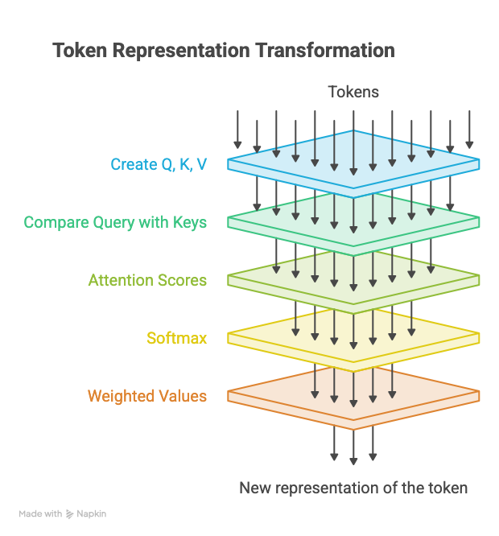
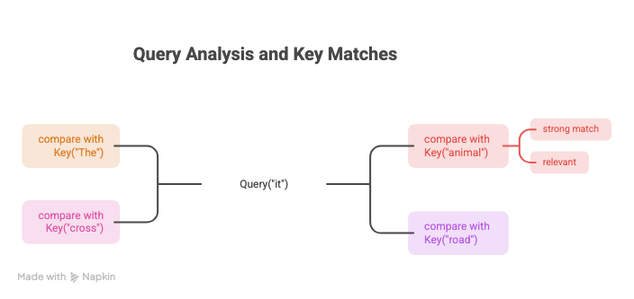
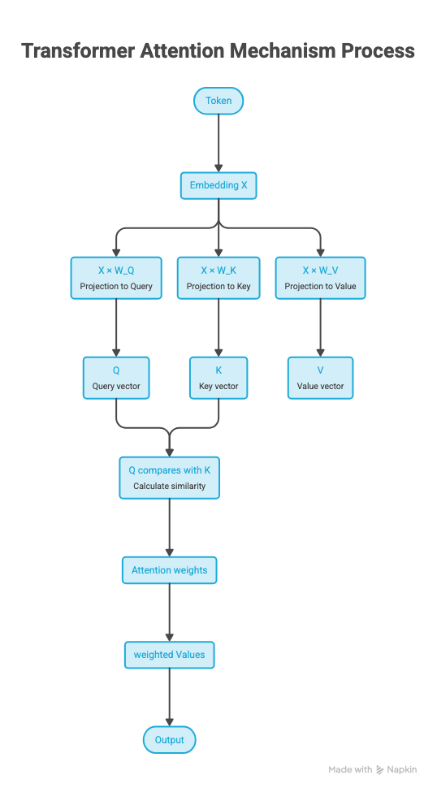
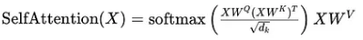
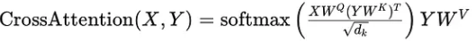
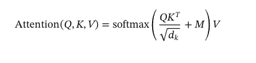

## What Problem Does Attention Solve?

Attention solves the problem of deciding which parts of the input are most relevant to the current token being processed.

## Intuition

Think of attention as a contextual lookup.

Let a token ask: _Which other tokens should I pay attention to in order to understand myself?_

## How Attention Works



### Tokens

The model doesn't directly see words. The text is converted into tokens, and each token becomes a vector.

### Q, K, V

For every token, the Transformer creates **three different vectors**:

- **Query:** what am I looking for?
- **Key:** what information do I contain?
- **Value:** what information should I actually provide?

The model learns a different projection for each purpose. The current token uses its **Query** to search the **Keys** of other tokens.

For example: "The animal didn't cross the road because **it** was too tired."



The query-key similarity determines the **attention score**. The model then uses those scores to create a weighted sum of the **Values**.

```text
Attention(Q, K, V) = softmax(QKᵀ / √d) V
```

### Attention Scores

The score is generally a dot product of Q and K. For the token "it" we calculate:

```text
Q_it · K_The
Q_it · K_animal
Q_it · K_didn't
Q_it · K_cross
Q_it · K_the
Q_it · K_road
Q_it · K_because
Q_it · K_it
Q_it · K_was
Q_it · K_tired
```

This gives raw scores for the token "it".

### Softmax

The raw scores are passed through the softmax function, which converts the scores for a token into probability-like weights that add up to 1. The output is a set of normalized weights.



## Self-Attention vs Cross-Attention

### Self-Attention

The **query, key, and value** all come from the **same input sequence**.

- Commonly used in encoder-only architectures like BERT and decoder-only architectures like GPT.
- The explanation above is, at its core, self-attention.



### Cross-Attention

The query comes from one input sequence, while the key and value come from another sequence.

In a machine translation model:

- The **decoder** generates English words.
- It uses cross-attention to look at the encoded German sentence.

Cross-attention is key to encoder-decoder architectures (for example translation and captioning) and is used in **multimodal models** (for example text attending to image embeddings).



## Causal Attention

Causal attention is a kind of **masked self-attention**.

When computing attention scores, it makes sure the model **only factors in tokens that occur at or before the current token** in the sequence.

**No future peeking:** it prevents the model from cheating by using future context when it is supposed to predict what comes next.



`M` is the causal mask matrix. Entries for future tokens contain negative infinity (−∞) and allowed positions contain 0.

## Multi-Head Attention

Multi-head attention is the mechanism used in Transformer models. It performs attention through multiple parallel heads, allowing the model to capture different relationships and patterns in the input sequence.

Instead of using a single set of Q, K, V matrices, the input embeddings are projected into multiple sets (heads), each with its own Q, K, V.

Each head runs its own self-attention, and the results from all heads are concatenated.

## Practical Engineering Considerations

### Context Length

Self-attention compares tokens with one another. For `n` tokens it creates an `n × n` relationship, so increasing context can significantly increase the work involved in attention.

This is why **more context isn't automatically better.**

### Latency

Attention has to compute relationships between tokens. During **prefill**, when the model processes the existing prompt, longer context generally means more attention computation and higher latency.

### Throughput

Throughput is how much work the system can handle over time. Attention consumes compute and memory, so efficient attention implementations and batching are used to improve it.

### GPU Memory

Attention has an important memory requirement. The attention scores are `QKᵀ`, so in the straightforward implementation the attention matrix takes **O(n²) memory**.

Optimized approaches such as **FlashAttention** reduce the memory overhead.

### Cost

Attention's computational and memory requirements ultimately affect inference cost.

## Common Interview Questions

- What problem does self-attention solve?
- How does self-attention work step by step?
- What are Query, Key, and Value, and why do we need all three?
- How are Q, K, and V generated from the input embeddings?
- How are attention scores calculated, and why is the dot product used?
- Why do we divide the attention scores by √dₖ?
- Why is Softmax applied to the attention scores?
- What is the complete scaled dot-product attention equation, and how does each part work?
- What is Multi-Head Attention, and why do we need multiple heads?
- Why is self-attention O(n²), and how does sequence length affect compute and memory?

## Resources

- [Attention Is All You Need](https://proceedings.neurips.cc/paper_files/paper/2017/file/3f5ee243547dee91fbd053c1c4a845aa-Paper.pdf)
- [Self-Attention vs Cross-Attention](https://medium.com/@xiaxiami/self-attention-vs-cross-attention-from-fundamentals-to-applications-4b065285f3f8)
- [FlashAttention](https://arxiv.org/abs/2205.14135)
- [Modern Methods of Text Generation](https://arxiv.org/pdf/2009.04968)

---

_I'm learning this in public. If something here is unclear or wrong, I'd like to hear it: [@ratishtwts](https://x.com/ratishtwts) on&nbsp;X._
