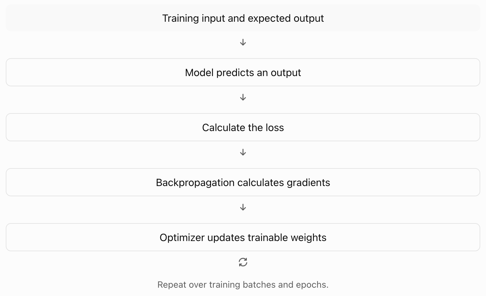

Fine-tuning is a method to change how a pretrained model behaves by training it on a specific dataset.

A pretrained model already has general knowledge. Fine-tuning helps the model perform a specific task, follow a specific format, or use a specific style.

## What problem does fine-tuning solve?

Imagine that you build an AI product for customer support.

You use an existing language model. The model can answer general questions. However, you need it to:

- Follow your company's response format.
- Classify support tickets into specific categories
- Use your company's preferred tone.
- Produce structured JSON for your backend.

You can give the model instructions in a prompt. However, the model may not follow these instructions well for every input.

You can use fine-tuning to train the model on examples of the behavior you want.

### Example: support ticket classification

Input: a customer says "I was charged twice for my subscription."

The fine-tuned model has learned the ticket categories and the expected output format from training examples, and produces:

```json
{
  "category": "billing",
  "priority": "high"
}
```

## How does fine-tuning work?

A language model contains parameters called weights.

These weights are numerical values that the model learns during training. They influence how the model processes input and predicts output.

Fine-tuning updates some or all of these weights using a new training dataset.

1. **Start with a pretrained model.** The model has already learned general language patterns and other capabilities.
2. **Prepare training examples.** Provide examples of inputs and the expected outputs.
3. **Train the model.** The training process measures prediction errors and uses optimization to update model weights.
4. **Evaluate the new model.** Test it on examples that were not used for training. Check if it performs better on your task.

## Fine-tuning vs prompting vs RAG

These three approaches solve different problems.

| Approach | What changes? | Best suited for |
| --- | --- | --- |
| Prompting | Instructions sent to the model | Guiding behavior with instructions and examples |
| RAG | Information supplied to the model at inference time | Answering questions using external or frequently updated data |
| Fine-tuning | Model weights | Teaching task-specific behavior, patterns, or output formats |

## Types of fine-tuning

There are several approaches. As an AI engineer, you should understand the following.

### Full fine-tuning

Update all or most of the model's trainable weights.

- Can provide substantial adaptation.
- Requires more compute and memory.
- Can be expensive for large models.

### Parameter-efficient fine-tuning (PEFT)

Update a small number of additional or selected parameters instead of all model weights.

- Reduces training memory and compute needs.
- Makes adapting large models more practical.
- Includes methods such as LoRA and QLoRA.

### Supervised fine-tuning (SFT)

Train a model on examples containing inputs and desired outputs.

- Commonly used for instruction following.
- Can teach classification and structured responses.
- Can use full fine-tuning or PEFT methods.

## What are LoRA and QLoRA?

These are important methods for practical fine-tuning.

### LoRA (Low-Rank Adaptation)

Instead of updating a large weight matrix directly, LoRA adds small trainable matrices to selected parts of the model.

The original model weights remain frozen. Training updates the added matrices.

Benefits:

- Fewer trainable parameters.
- Lower training memory requirements.
- Small adapter files that can be stored separately.

### QLoRA (Quantized Low-Rank Adaptation)

QLoRA combines a quantized base model with LoRA adapters.

The base model uses lower-precision representations to reduce memory use. The LoRA parameters are trained while the base model weights remain frozen.

Benefits:

- Lower memory requirements than many full fine-tuning setups.
- Makes some large-model fine-tuning tasks possible on more limited hardware.

Important: QLoRA reduces resource requirements. It does not remove the need for suitable hardware, training data, or evaluation.

## What does the training dataset look like?

For supervised fine-tuning, the dataset often contains input-output examples.

For the support ticket use case:

**Training example 1**

Input: "I was charged twice for my subscription."

Expected output: `{"category": "billing", "priority": "high"}`

**Training example 2**

Input: "I cannot reset my password."

Expected output: `{"category": "account_access", "priority": "medium"}`

A dataset needs enough relevant, high-quality examples for the task. More examples do not always produce better results.

Before training, you should:

1. Remove duplicate or incorrect examples.
2. Use consistent labels and output formats.
3. Separate training data from validation and test data.
4. Check that the data does not expose private information.
5. Include realistic examples of inputs the model will receive in production.

## What happens during training?

At a high level, the process works as follows:



Some key terms:

**Loss**: A value that measures the model's prediction error according to the training objective.

**Gradient**: Information about how the trainable weights affect the loss.

**Backpropagation**: The method used to calculate gradients.

**Optimizer**: The algorithm that uses gradients to update weights.

**Epoch**: One complete pass through the training dataset.

For causal language models, supervised fine-tuning commonly uses next-token prediction. The model learns to predict the expected response one token at a time.

## What can go wrong?

Fine-tuning is not guaranteed to improve a model.

| Problem | Meaning |
| --- | --- |
| Overfitting | The model performs well on training examples but poorly on new examples. |
| Catastrophic forgetting | Fine-tuning weakens some capabilities the pretrained model had. |
| Poor data quality | The model learns incorrect or inconsistent patterns. |
| Data leakage | Information from the evaluation set enters the training process. |
| Unnecessary fine-tuning | A prompt or RAG system could solve the problem at lower cost. |

You should evaluate the model against a baseline before you deploy it.

For example, compare the original model and the fine-tuned model using the same held-out test set. Measure task accuracy, output validity, latency, and inference cost where relevant.

## When should an AI engineer use fine-tuning?

Use this decision process.

- **Does the model need current or private reference information?** If yes, consider RAG or another data retrieval method.
- **Does the model need clearer instructions or a few examples?** If yes, try prompting first.
- **Does the model still fail at a repeated task or behavior after you improve the prompt and data?** If so, test fine-tuning against a baseline.

Fine-tuning may be useful when you need consistent task-specific behavior, specialized output patterns, or better performance on a well-defined task. You should verify the improvement through testing.

## Interview questions

1. What is fine-tuning?
2. How is fine-tuning different from prompting?
3. When would you use RAG instead of fine-tuning?
4. What is LoRA?
5. What is QLoRA?
6. What is catastrophic forgetting?
7. How do you evaluate a fine-tuned model?

## What should you build to learn fine-tuning?

Build a support ticket classifier using an open-source language model.

Start with a pretrained model and a small labeled dataset. Measure its performance before fine-tuning. Then apply LoRA or QLoRA and measure its performance again.
