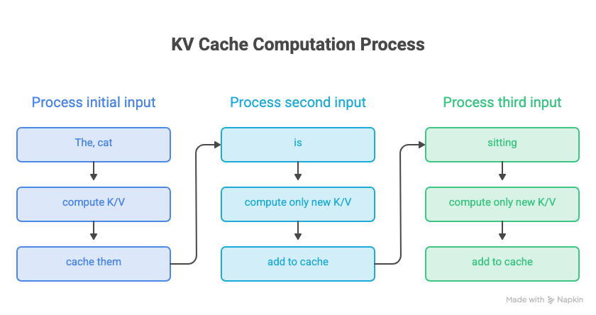
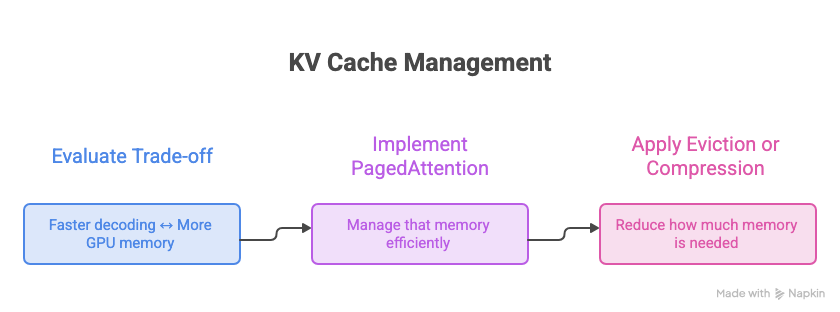
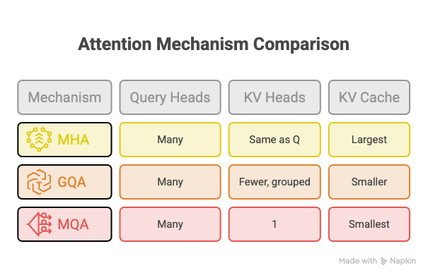

## Why KV Cache exists

During generation, the model repeatedly attends to previous tokens. KV Cache saves the Key and Value representations of those tokens so they can be reused instead of recomputed at every step, making generation faster while using more GPU memory.

Tradeoff is simple: fast computation with more GPU memory

## How autoregressive generation works without KV Cache

An LLM generates text **one token at a time.**

For example model might generate:

```markdown
The cat → is
The cat is → sitting
The cat is sitting → on
The cat is sitting on → the
```

Without KV Cache, the model repeatedly processes the **entire sequence** at every generation step.

For example, when generating `sitting`:

```markdown
The → Q₁ K₁ V₁
cat → Q₂ K₂ V₂
is  → Q₃ K₃ V₃
```

The model performs attention over these representations and predicts `sitting`.

When generating the next token, `on`, it processes everything again:

```markdown
The     → Q₁ K₁ V₁   ← recalculated
cat     → Q₂ K₂ V₂   ← recalculated
is      → Q₃ K₃ V₃   ← recalculated
sitting → Q₄ K₄ V₄   ← new
```

The important observation is that **the K and V representations of previous tokens haven't changed**. Yet, without a cache, they are calculated again at every generation step.

This is where **KV Cache** comes in: instead of throwing away the K and V representations after each step, the model stores them and reuses them when generating the next token.

## The key difference

**without KV Cache**

![Without KV Cache, each step recomputes everything: [The, cat], then [The, cat, is], then [The, cat, is, sitting], recomputing all tokens again each time](./kv-cache-assets/Untitled_-_Visual_4.png)

**with KV Cache**



## Common KV Cache Trade-offs

KV Cache grows with the number of tokens being generated.

```markdown
More tokens
    ↓
More K/V vectors
    ↓
Larger KV Cache
    ↓
More GPU memory
```

This becomes especially important when serving multiple requests simultaneously.

## Paged KV Cache / PagedAttention

A basic KV Cache can become inefficient when an inference server is handling many requests with different sequence lengths.

PagedAttention, introduced by the vLLM project, applies an idea similar to **virtual memory in operating systems**.

Instead of requiring each request's KV Cache to occupy one large contiguous region, the cache is divided into smaller **blocks/pages**.

```markdown
KV Cache

Request A → [Block 1] [Block 7] [Block 12]
Request B → [Block 2] [Block 4]
Request C → [Block 3] [Block 8] [Block 15]
```

The blocks don't have to sit next to each other in GPU memory.

A mapping keeps track of where each block belongs.

This allows the inference engine to use GPU memory more efficiently and makes it easier to dynamically allocate and manage KV Cache across many requests.

### Why it matters

PagedAttention is particularly useful for **LLM serving**, where the goal isn't just to make one request fast.

The system needs to efficiently handle:

```markdown
Many users
   ↓
Many concurrent sequences
   ↓
Many KV Caches
   ↓
Limited GPU memory
```

So PagedAttention is primarily a **memory-management technique for KV Cache**, rather than a change to the underlying attention mechanism.

## KV Cache Eviction / Compression

KV Cache grows as the sequence gets longer.

Eventually, the cache can become too large for the available GPU memory.

So another question arises:

> **Do we really need to keep every cached token?**

Not necessarily.

Some techniques attempt to **remove, compress, or otherwise reduce the amount of KV Cache that needs to remain in memory.**

The basic idea is:

```markdown
Large KV Cache
      ↓
Identify less useful tokens
      ↓
Remove some K/V entries
      ↓
Smaller KV Cache
```

### KV Cache Compression

Instead of completely removing information, compression techniques try to represent the cache using **less memory**.

Different approaches can reduce memory through techniques such as:

- storing K/V representations at lower precision (Quantized KV)
- reducing the number of stored K/V vectors
- selectively retaining important tokens
- sharing or grouping K/V representations

Reduce KV Cache memory while keeping the impact on generation quality as small as possible.



## Multi-Head Attention and KV Cache

**Multi-Head Attention (MHA)** uses multiple attention heads, where each head has its own **Q, K, and V** projections.

During autoregressive generation, the **K and V from previous tokens are stored in the KV Cache** so they don't need to be recomputed.

More attention heads → more K/V data → larger KV Cache.

## MHA vs MQA vs GQA

The main difference is **how K/V heads are shared across Query heads**:



**GQA and MQA reduce KV Cache memory by sharing K/V across multiple Query heads.**

## Top 10 KV Cache Interview Questions

- **What is KV Cache, and why is it needed during LLM inference?**
- **What exactly is stored in the KV Cache?**
- **Why are Key and Value cached but not Query?**
- **How does autoregressive generation work without KV Cache?**
- **How does generation change when KV Cache is enabled?**
- **How does KV Cache reduce computation during token generation?**
- **How much GPU memory does KV Cache consume, and what factors affect its size?**
- **What are the main trade-offs of using KV Cache?**
- **What is PagedAttention, and why is it useful for KV Cache management?**
- **How do MQA and GQA reduce KV Cache memory usage?**