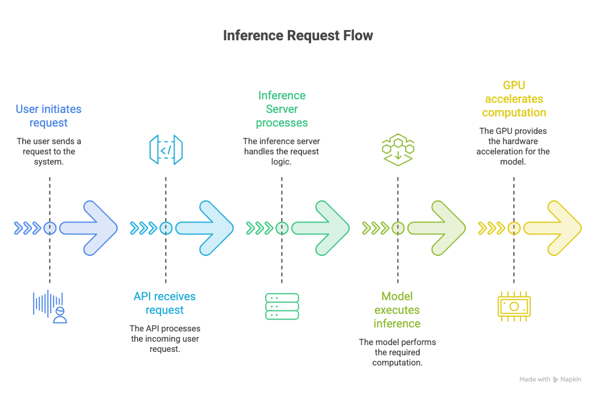
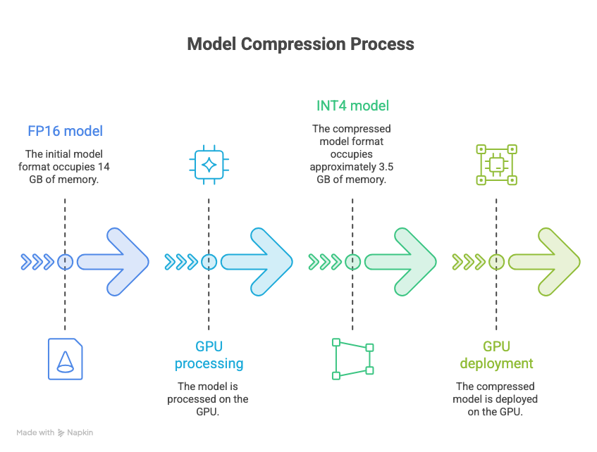
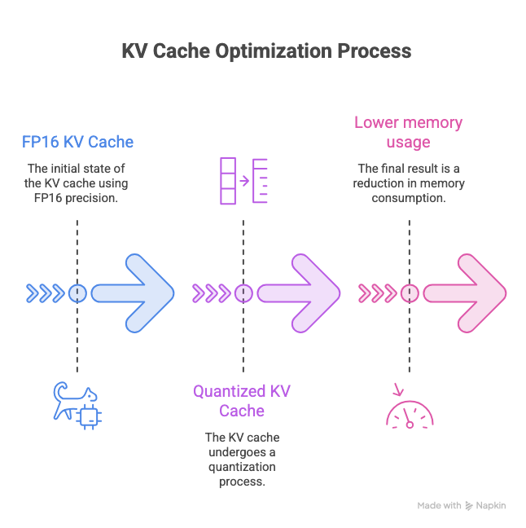

## What is Quantization?

Quantization reduces the number of bits used to store and process model values.

An LLM stores many numbers.

These numbers are usually model weights and activations.

For example, a model can store a weight like: 0.23847

In FP32, this value uses **32 bits**.

Quantization can store a similar value with fewer bits.

```text
FP32 → 32 bits
FP16 → 16 bits
INT8 → 8 bits
INT4 → 4 bits
```

aim: Use fewer bits while keeping model quality close to the original.

## Why Do We Need Quantization?

LLMs can have billions of parameters.

Each parameter needs memory.

For example, consider a model with **7 billion parameters**.

for FP32

```text
7B × 4 bytes
≈ 28 GB
```

For FP 16

```text
7B × 2 bytes
≈ 14 GB
```

Now use INT8:

```text
7B × 1 byte
≈ 7 GB
```

Now use INT4:

```text
7B × 0.5 byte
≈ 3.5 GB
```

So quantization can greatly reduce memory use.

## What Does a Bit Mean?

A bit can store two values:

```text
0
1
```

More bits allow more possible values.
A model with fewer bits has fewer possible values for each number.

This means quantization introduces an approximation.

## Quantization Is Approximation

Suppose the original model has: 0.23847

A quantized model may not store this exact value.

It may store a smaller representation.

During computation, the system reconstructs an approximate value.

For example:

```text
Original:
0.23847

Quantized:
0.24
```

Quantization trades some numerical precision for lower memory and faster computation.

## How Does Quantization Work?

A simple quantization method maps many floating-point values to a smaller set of values.

Consider:

```text
-1.0
-0.8
-0.6
-0.4
-0.2
 0.0
 0.2
 0.4
 0.6
 0.8
 1.0
```

A quantizer may map these values to a smaller set of integer values.

The system also stores a **scale**.
The scale helps convert the quantized value back to an approximate floating-point value.

## Scale and Zero Point

The **scale** tells us how large each quantized step is.

The **zero point** tells us which integer represents zero.

A simplified equation is:

```text
quantized = round(float_value / scale) + zero_point
```

To get an approximate original value:

```text
float_value ≈ (quantized - zero_point) × scale
```

Quantization uses a smaller numerical representation plus metadata such as scale and zero point.

## Weight Quantization

One common approach is to quantize the model weights.

```text
Original weights
       ↓
Quantization
       ↓
INT8 / INT4 weights
```

This reduces:

- GPU memory usage
- CPU memory usage
- Model loading time
- Memory bandwidth requirements

## Activation Quantization

Weights are not the only values in an LLM.
The model also produces **activations** during inference.

These values can also be quantized.

This can provide greater performance improvements.
But activation quantization is usually more difficult, Because activations can have a wider and less predictable range.

A common approach for LLM inference is Weight-Only Quantization:

```text
Weights  are quantized
Activations are of higher precision
```

## PTQ vs QAT

### Post-Training Quantization

Train the model first. Quantize it later.

This is simple and common.

You do not need to retrain the model.

### Quantization-Aware Training

Train the model while considering quantization.

```text
Training
   ↓
Simulate quantization
   ↓
Adjust model
   ↓
Quantized model
```

QAT can preserve accuracy better.

But it requires additional training work.

## Quantization and Inference

Quantization can improve inference in several ways.

### 1. Smaller model

The model needs less storage.

### 2. Lower GPU memory usage

More models can fit on the same GPU.

### 3. Lower memory bandwidth

Less data needs to move between memory and compute units.

### 4. Better hardware utilization

Some GPUs and CPUs have optimized low-precision operations.

### 5. Lower cost

Smaller models can require fewer or smaller GPUs.

But quantization does **not automatically make every model faster**.

The hardware and inference engine must support the chosen format efficiently.

## Important Quantization Methods

As an AI Engineer, you will see several names.

### GPTQ

A post-training quantization method.

It became popular for quantizing LLM weights to low precision.

### AWQ

**Activation-aware Weight Quantization.**

It focuses on protecting important weights based on activation information.

It is widely used for LLM inference.

### SmoothQuant

A method designed to make activation quantization easier.

It moves some of the difficulty from activations to weights.

### bitsandbytes

A popular library used for low-bit model loading and quantization.

## GPTQ vs AWQ

At a high level:

| Method | Main idea |
| --- | --- |
| GPTQ | Quantize weights after training |
| AWQ | Protect important weights using activation information |
| SmoothQuant | Make activation quantization easier |
| QAT | Train the model with quantization in mind |

You do not need to memorize the implementation details yet.

You should understand **why these methods exist**.

## Quantization Formats

Do not confuse a **quantization method** with a **model file format**.

For example: GPTQ and AWQ are quantization approaches.

You may also encounter formats such as: GGUF

GGUF is a model file format commonly used by the llama.cpp ecosystem.

A model can contain quantized weights in a specific format.

This distinction becomes important when you deploy local LLMs.

## Quantization in the Production Stack

Think about an inference system like this:



Quantization changes how the model is stored and processed.

For example:



This can make a large difference when serving many requests

## Quantization and KV Cache

This is an important connection to our previous topic.

Quantization can also reduce memory used by the KV cache.

A Quantized KV Cache uses less GPU memory



## What Should You Remember?

For an AI Engineer interview, remember these points:

### Quantization

Reduce the number of bits used to represent model values.

### Main goal

Reduce:

- Memory
- Memory bandwidth
- Cost

And potentially improve:

- Latency
- Throughput

**Important formats**

```text
FP32
FP16
BF16
INT8
INT4
```

**Important approaches**

```text
PTQ
QAT
Weight-only
Weight + activation
```

**Important methods**

```text
GPTQ
AWQ
SmoothQuant
```
