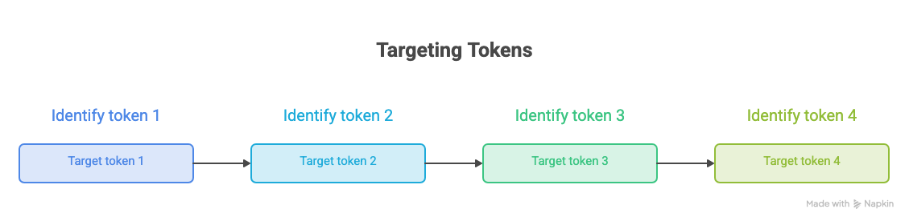
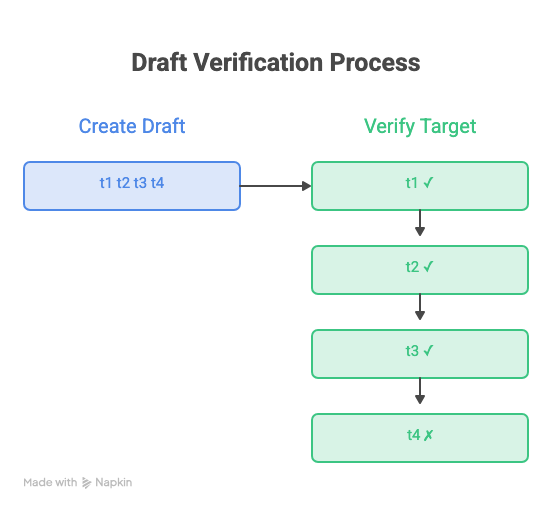
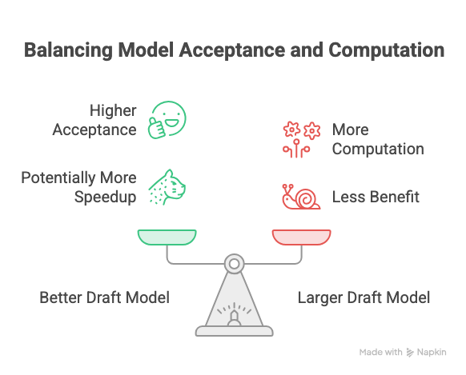
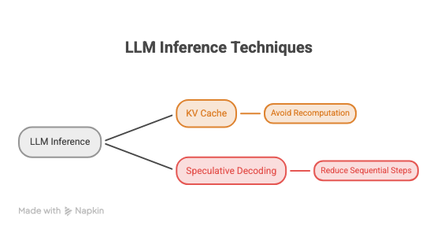

## The problem

an LLM generates tokens one at a time (sequential):

```text
The → cat → is → sitting → on → the → mat
```

For every new token, the large model has to run another forward pass.

## How Speculative Decoding Solves the Problem

We introduce two models:

- Draft model - small and fast
- Target model - large and accurate

Example:

```text
Prompt: "The cat is"

Draft model:
    "sitting on the mat"

Target model:
    verifies all these proposed tokens
```

without speculative decoding:



with speculative decoding:



Key benefit: More accepted tokens per target-model forward pass

## How it works

Suppose the current sequence is:

```text
The cat is
```

**Step 1: Draft model generates K tokens**

suppose K = 4

```text
The cat is sitting on the mat
              ↑     ↑   ↑   ↑
             t1    t2  t3  t4
```

**Step 2: Target model verifies them**

The large model processes the proposed sequence and produces probabilities for:

```text
P(t1)
P(t2 | t1)
P(t3 | t1,t2)
P(t4 | t1,t2,t3)
```

Because transformers can process a sequence **in parallel during the forward pass**, the target model doesn't need four completely separate forward passes just to evaluate those four proposals.

**Step 3: Accept or reject**

For each proposed token, we compare the draft model's probability with the target model's probability.

If the draft's prediction agrees sufficiently with the target distribution, the token is accepted.
If a token is rejected, generation falls back to the target model at that point.

## Important concept: acceptance rate

One of the most important metrics is the **acceptance rate**.

If the draft model proposes 5 tokens and the target accepts 4:

Higher acceptance generally means better speedup.

but there is a tradeoff:



draft model should be cheap enough to run quickly + accurate enough to make useful predictions.

## When does speculative decoding work well?

It works particularly well when:

**Draft and target models are similar**

For example:

```text
Small Llama model
        ↓
Large Llama model
```

The small model tends to predict similar continuations.

## Relationship with KV Cache

This is important given what we just covered.

KV Cache:

> Avoid recomputing previous attention states.


Speculative decoding:

> Avoid making the large model generate every token sequentially.


They attack **different bottlenecks**.



## Main Tradeoffs

| Factor | Effect |
| --- | --- |
| Smaller draft model | Faster drafting |
| Better draft model | Higher acceptance |
| Higher acceptance | More speedup |
| Too many speculative tokens | More rejected work |
| Poor draft/target alignment | Low acceptance |
| Extra model | More memory/complexity |

The biggest engineering question becomes:

**is the cost of drafting cheaper than the target-model computation it saves?**

## Interview mental model

The three things I'd remember are:

```text
Draft → Verify → Accept/Reject
```

```text
Main benefit = fewer sequential target-model steps
```

```text
Key metric = acceptance rate
```
